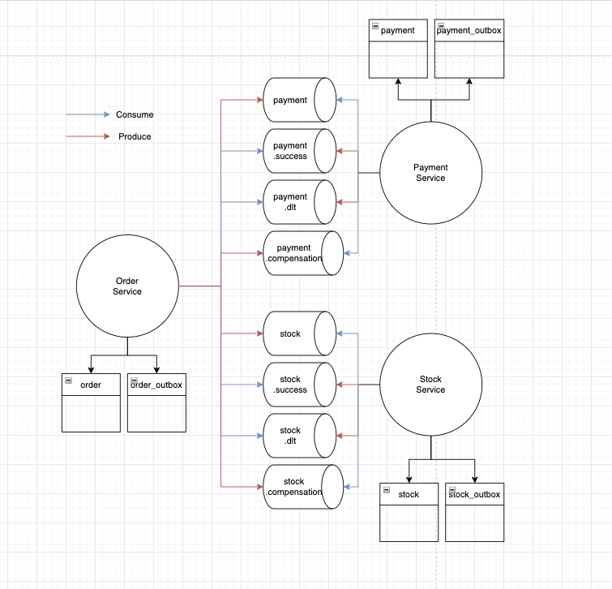
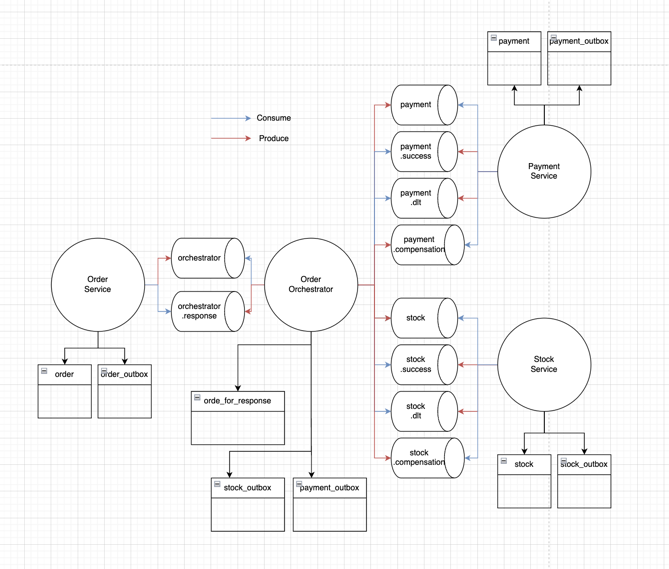

# Description

1. outbox-with-choreography([outbox-pattern-with-choreography](/outbox-pattern/README.md))

2. outbox-with-orchestration([outbox-pattern-with-orchestration](/outbox-pattern-with-orchestration/README.md))

