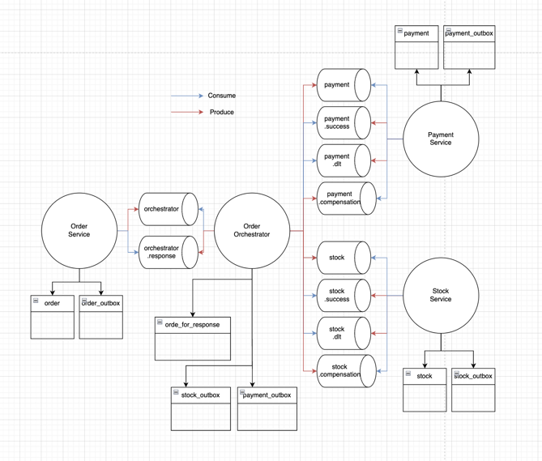

# Outbox pattern + Saga pattern(Orchestration)

## 1. Architecture



## 2. Install(zookeeper, kafka)
1. Download kafka

https://kafka.apache.org/downloads

2. Start Zookeeper
```
bin/zookeeper-server-start.sh config/zookeeper.properties
```

3. Start Kafka
```
bin/kafka-server-start.sh config/server.properties
``` 

4. Create Topic
```
bin/kafka-topics.sh --create --bootstrap-server localhost:9092 --topic orchestrator
bin/kafka-topics.sh --create --bootstrap-server localhost:9092 --topic orchestrator.response


bin/kafka-topics.sh --create --bootstrap-server localhost:9092 --topic payment
bin/kafka-topics.sh --create --bootstrap-server localhost:9092 --topic payment.success
bin/kafka-topics.sh --create --bootstrap-server localhost:9092 --topic payment.dlt
bin/kafka-topics.sh --create --bootstrap-server localhost:9092 --topic payment.compensation

bin/kafka-topics.sh --create --bootstrap-server localhost:9092 --topic stock
bin/kafka-topics.sh --create --bootstrap-server localhost:9092 --topic stock.success
bin/kafka-topics.sh --create --bootstrap-server localhost:9092 --topic stock.dlt
bin/kafka-topics.sh --create --bootstrap-server localhost:9092 --topic stock.compensation

// check topic
bin/kafka-topics.sh --list --bootstrap-server localhost:9092
```

5. Create Database

```
// Use same DB Instance.
create database order_orchestratordb;
create database orderdb;
create database stockdb;
create database paymentdb;
```

6. Start Spring boot
```
order-orchestrator(8080)
order-service(8081)
payment-service(8082)
stock-service(8083)
```


## 3. Concern

### 1. outbox pattern 을 써야하는 경우는 어떤 경우인가요??

answer: 즉각적인 반응이 아닌 주기적으로 실행해도 되는 로직. 예를 들면 compensation 을 가정해보자. payment 에 대한 compensation 은 2가지 인 경우 실행된다. stock 이 실패했을 경우, payment 가 성공했는데 stock 이 실패했을 경우이다. 이런 경우 outbox pattern 사용 시 중복되는 compensation 요청이 나갈 수 있어 이런 경우는 outbox pattern 을 사용해서는 안된다. 
