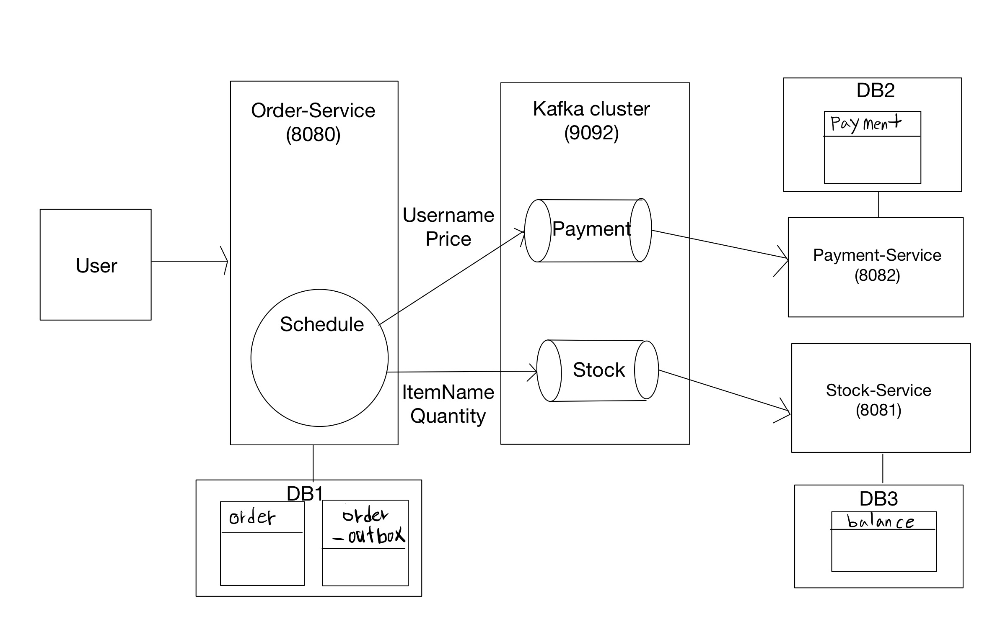

# Outbox pattern

## 1. Architecture



## 2. Install(zookeeper, kafka)

1. Download kafka

https://kafka.apache.org/downloads

2. Start Zookeeper
```
bin/zookeeper-server-start.sh config/zookeeper.properties
```

3. Start Kafka
```
bin/kafka-server-start.sh config/server.properties
``` 

4. Create Topic
```
bin/kafka-topics.sh --create --bootstrap-server localhost:9092 --topic payment
bin/kafka-topics.sh --create --bootstrap-server localhost:9092 --topic stock

// check topic
bin/kafka-topics.sh --list --bootstrap-server localhost:9092
```

5. Create Database

```
// Use same DB Instance.
create database orderdb;
create database stockdb;
create database paymentdb;
```

6. Start Spring boot
```
order-service(8080)
stock-service(8081)
payment-service(8082)
```

## 3. Concern

### 1. What if I succeeded in publishing on Payment Topic but failed to publishing on Stock Topic?

answer: You need to roll back the message that went into the Payment Topic. And the data in the order_outbox table data should not be deleted.

### 2. If multiple Springboot instances run a schedule, at some point two instances can send messages at the same time. What should I do in this case?

answer1: Use the leader selection feature to modify only one instance to be scheduled.

answer2: Add validation logic in the payment-service, stock-service, which conferences the published message.

### 3. How do I guarantee publish producer message?

answer: Record the storage time in the order_outbox table and publish it in order.


